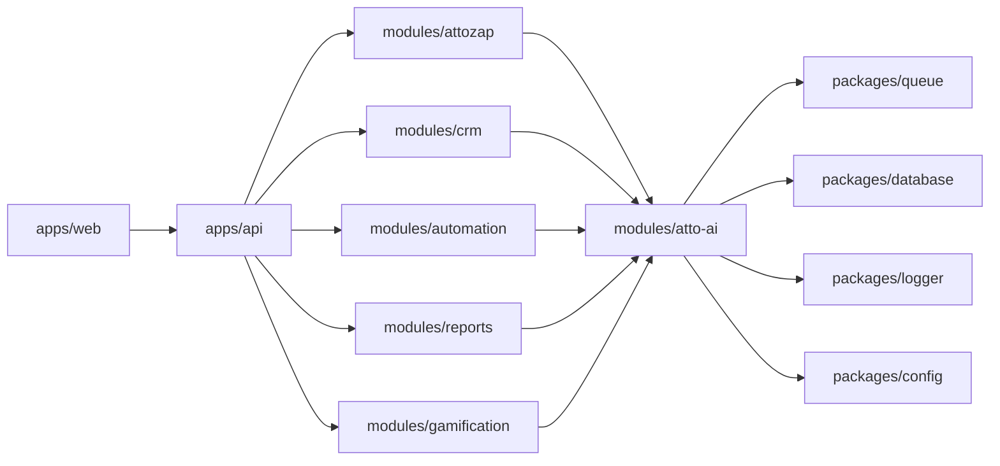

# Mapa de módulos ATTO FLOW

## Plataforma principal

A ATTO FLOW é o produto final. ATTOZAP, ATTO AI, CRM, Automation, Reports e Gamification são módulos internos com experiências integradas.

## Dependências permitidas

## Regras

- `modules/atto-ai` pode ser chamado por módulos internos, mas não deve impor telas próprias ao usuário final.
- `modules/attozap` concentra WhatsApp, campanhas, conexões e atendimento comercial.
- `modules/crm` concentra entidade lead, pipeline, histórico e produtividade individual.
- `modules/automation` orquestra eventos, filas e decisões automatizadas, usando ATTO AI quando necessário.
- `modules/reports` pode chamar ATTO AI para explicar métricas e gerar insights.
- `modules/gamification` consome eventos de CRM/ATTOZAP e pode chamar ATTO AI para desafios e análises.
