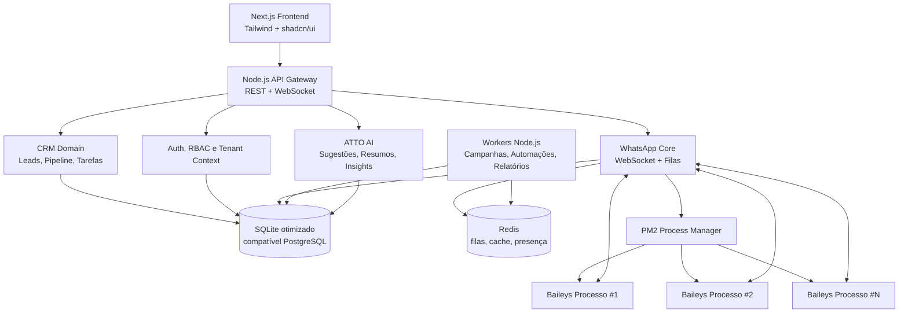

# Arquitetura ATTOZAP

## 1. Visão geral

A ATTO FLOW é uma plataforma SaaS multiempresa para automação, CRM, WhatsApp, atendimento comercial e gestão de equipes. A primeira vertical é imobiliária, mas o domínio deve ser genérico o suficiente para segmentos como consórcios, clínicas, educação, veículos, seguros, serviços locais e vendas B2B.

A arquitetura parte do Evo CRM Community como base de CRM e atendimento, mas adiciona quatro pilares críticos:

1. **Multi-tenant corporativo** com hierarquia Owner → Empresa → Diretor → Superintendente → Gerente → Corretor.
2. **WhatsApp Baileys sem Docker**, com processos independentes supervisionados por PM2.
3. **Motor de automação visual** orientado a eventos e filas.
4. **Camada de inteligência operacional** com ATTO AI assistiva, relatórios, metas e gamificação.

A camada de IA citada nesta arquitetura é sempre a **ATTO AI**, módulo interno da ATTO FLOW. Ela não deve ser apresentada como sistema separado para o usuário final; ATTOZAP, CRM, Automation, Reports e Gamification a consomem por serviços internos.

## 2. Arquitetura lógica

## 3. Componentes principais

### 3.1 Frontend

Stack-alvo:

- React com Next.js.
- Tailwind CSS.
- shadcn/ui.
- Recharts ou Tremor para dashboards.
- TanStack Query para cache de API.
- Zustand ou Redux Toolkit para estado local complexo.

Áreas da interface:

- Dashboard executivo.
- Pipeline Kanban.
- Inbox WhatsApp.
- Central de conexões.
- Campanhas.
- Automações visuais.
- Consulta CPF.
- Aquecimento de chips.
- Metas.
- Gamificação.
- Relatórios.
- Administração da empresa.
- Administração global do Owner.

### 3.2 Backend Node.js

Stack recomendada:

- Node.js LTS.
- NestJS ou Fastify modular.
- Prisma ou Drizzle ORM com SQLite e compatibilidade PostgreSQL.
- Zod para validação de contratos.
- Redis + BullMQ para filas.
- WebSocket Gateway para presença, QR Code, status de campanhas e monitoramento.

Módulos de domínio:

- `tenancy`: empresas, assinatura, contexto e isolamento.
- `identity`: usuários, papéis, permissões e hierarquia.
- `crm`: leads, pipelines, etapas, histórico, tags e tarefas.
- `whatsapp`: conexões, sessões, mensagens, QR Code, health check e reconexão.
- `campaigns`: disparos, segmentação, agendamento, pausa e cancelamento.
- `automation`: gatilhos, nós, ações, condições e logs.
- `cpf`: configuração de grupos, requisições, respostas e vínculo com leads.
- `warmup`: conversas automáticas, rotação de conteúdo e saúde de linha.
- `ai`: sugestões, resumos, classificação, insights e políticas de aprovação.
- `goals`: metas individuais, por equipe e por empresa.
- `gamification`: pontuação, ranking, loja, recompensas e desafios.
- `reports`: agregações, exportação PDF, Excel e CSV.
- `audit`: trilha completa de eventos e ações administrativas.

## 4. Multiempresa e hierarquia

### 4.1 Papéis

| Papel | Escopo | Permissões principais |
|---|---|---|
| Owner | Plataforma inteira | Multiempresa, infraestrutura, financeiro, configurações globais e suporte técnico. |
| Empresa/Admin | Empresa | Controle total da empresa, usuários, números, campanhas, relatórios e configurações. |
| Diretor | Empresa | Visualiza todas as equipes e indicadores estratégicos. |
| Superintendente | Grupo de gerentes | Visualiza múltiplos gerentes e consolida produtividade. |
| Gerente | Equipe | Visualiza sua equipe, metas, leads e relatórios do time. |
| Corretor | Próprio usuário | Visualiza seus próprios leads, conversas, tarefas, metas e ranking individual. |

### 4.2 Regras de autorização

Toda consulta deve aplicar dois filtros obrigatórios:

1. **Filtro de tenant**: garante que a empresa só leia dados próprios.
2. **Filtro hierárquico**: restringe o alcance de acordo com o papel do usuário.

Exemplos:

- Corretor: `company_id = current_company_id AND assigned_user_id = current_user_id`.
- Gerente: `company_id = current_company_id AND team_id IN managed_team_ids`.
- Diretor: `company_id = current_company_id`.
- Owner: pode alternar empresa, mas toda ação administrativa deve ser auditada.

## 5. CRM

### 5.1 Pipeline padrão

Etapas iniciais:

1. Oferta Ativa.
2. Conversando.
3. Agendado.
4. Visitou.
5. Proposta.
6. Venda.
7. Perdido.
8. Descartado.

As etapas devem ser configuráveis por empresa para permitir outros segmentos no futuro.

### 5.2 Lead

Campos mínimos:

- Nome.
- Telefone.
- CPF.
- Origem.
- Empresa.
- Corretor responsável.
- Pipeline e etapa.
- Histórico completo.
- Tags.
- Anotações.
- Data de criação.
- Data da última interação.

Eventos de CRM:

- `lead.created`.
- `lead.assigned`.
- `lead.stage_moved`.
- `lead.note_added`.
- `lead.tag_added`.
- `lead.whatsapp_message_received`.
- `lead.whatsapp_message_sent`.
- `lead.won`.
- `lead.lost`.
- `lead.discarded`.

## 6. WhatsApp Baileys

### 6.1 Decisão arquitetural

O WhatsApp deve usar **Baileys sem Docker**. Cada número deve ter:

- Um processo independente PM2.
- Um socket próprio.
- Estado de autenticação isolado.
- Health check individual.
- Reconexão automática.
- Comunicação com o core central por WebSocket.

### 6.2 Componentes

| Componente | Responsabilidade |
|---|---|
| WhatsApp Core | API central, WebSocket, roteamento, persistência, health e comandos. |
| Process Manager | Cria, reinicia, pausa e remove processos PM2 por conexão. |
| Baileys Worker | Mantém socket do número, envia/recebe mensagens e emite eventos. |
| Queue Dispatcher | Controla envio individual, campanhas, rate limits, pausa e cancelamento. |
| Monitor | Calcula uptime, falhas, mensagens enviadas/recebidas e estado da linha. |

### 6.3 Ciclo de conexão

1. Admin cria conexão com nome, número e empresa.
2. Core registra conexão com status `pending`.
3. Process Manager cria processo PM2 para o número.
4. Worker Baileys inicia socket e solicita QR Code.
5. QR Code é transmitido em tempo real para o frontend.
6. Após pareamento, status muda para `connected`.
7. Worker envia heartbeats periódicos.
8. Em queda, worker tenta reconectar e o core atualiza status.
9. Se exceder limite de falhas, conexão vira `attention_required`.

### 6.4 Recursos obrigatórios

- QR Code em tempo real.
- Conexão múltipla por empresa.
- Envio individual.
- Envio em massa.
- Campanhas com fila.
- Pausa e retomada.
- Cancelamento de envios pendentes.
- Agendamento.
- Rate limit por conexão.
- Logs de auditoria.

## 7. Central de conexões

Cada conexão deve exibir:

- Nome.
- Número.
- Status.
- Empresa.
- QR Code quando aplicável.
- Tempo online.
- Mensagens enviadas.
- Mensagens recebidas.
- Último heartbeat.
- Processo PM2 vinculado.
- Alertas de saúde.

Status recomendados:

- `pending`.
- `qr_required`.
- `connecting`.
- `connected`.
- `disconnected`.
- `reconnecting`.
- `paused`.
- `attention_required`.
- `banned_or_blocked`.

## 8. Automações visuais

O criador visual deve seguir modelo de grafo, semelhante ao n8n:

- Gatilhos.
- Condições.
- Ações.
- Delays.
- Branches.
- Logs por execução.
- Versionamento de fluxo.
- Ambiente de teste/simulação.

Gatilhos iniciais:

- Lead entrou.
- Lead mudou de etapa.
- Mensagem recebida.
- Mensagem não respondida após X minutos.
- Campanha concluída.
- Meta atingida.
- CPF consultado.

Ações iniciais:

- Mover etapa.
- Enviar mensagem.
- Criar tarefa.
- Notificar gerente.
- Notificar corretor.
- Atualizar lead.
- Adicionar tag.
- Solicitar aprovação humana.

## 9. Consulta CPF

Fluxo operacional:

1. Corretor informa CPF no lead ou na página de consulta.
2. Sistema cria `cpf_lookup_request`.
3. Worker envia CPF ao grupo configurado da empresa.
4. Sistema aguarda resposta correlacionada.
5. Resposta pode ser texto ou imagem.
6. Resultado é salvo, auditado e vinculado ao lead.
7. CRM exibe o resultado no histórico e no painel do lead.

Configurações por empresa:

- Grupo de CPF.
- Grupo de aquecimento.
- Conexão WhatsApp padrão para consulta.
- Timeout de resposta.
- Permissões de quem pode consultar.

## 10. Aquecimento de chips

O módulo de aquecimento deve proteger a operação e reduzir risco de bloqueios.

Funções:

- Conversas automáticas entre linhas próprias.
- Rotação de conteúdo por categoria.
- Janelas de horário.
- Limites diários por número.
- IA opcional para variações de mensagens.
- Monitoramento de saúde da linha.
- Alertas para quedas, banimentos ou comportamento anormal.

Métricas de saúde:

- Uptime.
- Falhas de envio.
- Tempo médio conectado.
- Volume enviado/recebido.
- Taxa de resposta.
- Incidentes por período.

## 11. ATTO AI

A IA deve ser uma camada assistiva e auditável.

Funções:

- Sugestão de respostas.
- Análise de lead.
- Classificação de intenção.
- Resumo de conversas.
- Geração de mensagens.
- Recomendações comerciais.
- Insights de vendas.
- Detecção de risco operacional.

Regra de segurança principal:

> A IA nunca envia mensagem diretamente ao cliente sem autorização humana ou regra explícita aprovada pela empresa.

Políticas mínimas:

- Logs de prompt e resposta com mascaramento de dados sensíveis.
- Aprovação humana para mensagens externas.
- Configuração por empresa para habilitar/desabilitar funções.
- Limites de uso por plano.

## 12. Dashboard e indicadores

Indicadores iniciais:

- Leads cadastrados.
- Conversas efetivas.
- Agendamentos.
- Visitas.
- Propostas.
- Vendas.
- Conversão por etapa.
- Tempo médio de resposta.
- Campanhas ativas.
- Conexões online.
- Produtividade por equipe.
- Ranking de corretores.

O dashboard deve respeitar o escopo hierárquico do usuário logado.

## 13. Metas

Tipos de metas:

- Individual.
- Equipe.
- Empresa.

Indicadores:

- Leads.
- Conversas.
- Agendamentos.
- Visitas.
- Vendas.

As metas devem gerar eventos para gamificação e notificações.

## 14. Gamificação

Pontuações iniciais:

- Lead cadastrado.
- Conversa efetiva.
- Agendamento.
- Visita.
- Venda.

Recursos:

- Ranking diário.
- Ranking semanal.
- Ranking mensal.
- Loja de prêmios.
- Resgate de recompensas.
- Desafios do dia.
- Badges por desempenho.

A pontuação deve ser recalculável a partir de eventos auditáveis para evitar inconsistências.

## 15. Relatórios

Relatórios disponíveis a partir do nível Gerente:

- Equipe.
- Corretor.
- Empresa.
- Campanhas.
- Conversões.
- Funil.
- WhatsApp.
- Produtividade.

Exportações:

- PDF.
- Excel.
- CSV.

Relatórios pesados devem ser processados em background e entregues por notificação/download assinado.

## 16. Design e UX/UI

Direção visual:

- Dark Premium.
- Preto fosco.
- Roxo tecnológico.
- Azul neon discreto.
- Cards com profundidade leve.
- Sidebar moderna.
- Microinterações fluidas.
- Gráficos avançados.
- Layout responsivo para operação em notebook e desktop.

Referências de experiência:

- HubSpot para CRM e clareza de funil.
- Salesforce para hierarquia e relatórios.
- Kommo para WhatsApp e funil conversacional.
- Pipedrive para Kanban comercial.
- Monday e ClickUp para produtividade e automações.

## 17. Escalabilidade

### Fase inicial

- Monólito modular Node.js.
- SQLite otimizado por tenant pequeno/médio.
- Redis para filas, locks e cache.
- PM2 para API, workers e processos WhatsApp.
- Backups automáticos do banco e sessões WhatsApp.

### Fase crescimento

- PostgreSQL gerenciado.
- Separação de workers por domínio.
- Read replicas para relatórios.
- Object storage para mídias e exportações.
- Métricas com Prometheus/Grafana ou stack equivalente.

### Fase escala nacional

- API stateless horizontal.
- WhatsApp shards por host.
- Filas particionadas por empresa/conexão.
- Data warehouse para BI.
- Feature flags por plano e segmento.

## 18. Observabilidade e segurança

Obrigatório desde o MVP:

- Logs estruturados por `request_id`, `tenant_id` e `user_id`.
- Auditoria de ações sensíveis.
- Rate limits por usuário, empresa e conexão WhatsApp.
- Backup diário.
- Criptografia de tokens e sessões sensíveis.
- Mascaramento de CPF e telefone em logs.
- Health checks para API, Redis, filas, workers e conexões.
- Alertas para fila travada, conexão instável e falha de campanha.

## 19. Planos SaaS sugeridos

| Plano | Público | Limites típicos |
|---|---|---|
| Starter | Pequenas equipes | 1 empresa, poucos usuários, poucas conexões, CRM e WhatsApp básico. |
| Growth | Imobiliárias em expansão | Equipes, campanhas, metas, relatórios e automações. |
| Scale | Operações maiores | Multi-equipes, IA, gamificação, permissões avançadas e exportações. |
| Enterprise | Redes e franquias | SLA, multiunidades, auditoria avançada, customizações e suporte dedicado. |

## 20. Decisões críticas

1. Não acoplar domínio ao mercado imobiliário; imobiliária é a primeira vertical, não o limite da plataforma.
2. Tratar WhatsApp como infraestrutura operacional crítica, com processos isolados e monitoramento em tempo real.
3. Modelar gamificação e metas por eventos para manter auditoria e recomputação.
4. Manter IA sempre assistiva no MVP, evitando risco reputacional e operacional.
5. Projetar SQLite com compatibilidade real de migração para PostgreSQL.
